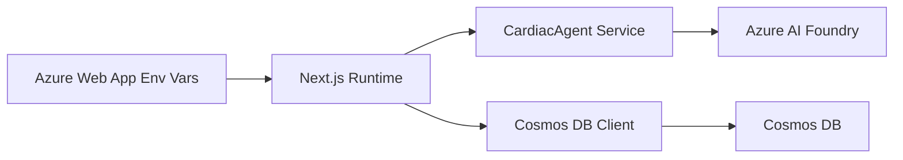

# Azure Environment Variables Configuration Update

## 🔧 Updated Configuration

The application has been updated to use the specific environment variable names you configured in Azure Web App:

### ✅ Environment Variables Mapped

| Azure Web App Variable | Purpose | Used In |
|------------------------|---------|---------|
| `AZURE_AI_FOUNDRY_API_KEY` | Azure AI Foundry authentication | cardiacAgent.ts |
| `AZURE_AI_ORCHESTRATION_AGENT_ID` | Orchestration agent identifier | cardiacAgent.ts |
| `AZURE_PROJECT_NAME` | Azure AI project name | cardiacAgent.ts |
| `AZURE_RESOURCE_GROUP_NAME` | Azure resource group | cardiacAgent.ts |
| `AZURE_SUBSCRIPTION_ID` | Azure subscription ID | cardiacAgent.ts |
| `COSMOS_DB_CONTAINER_NAME` | Cosmos DB container name | cosmos.ts |
| `COSMOS_DB_DATABASE_NAME` | Cosmos DB database name | cosmos.ts |
| `COSMOS_DB_ENDPOINT` | Cosmos DB endpoint URL | cosmos.ts |
| `COSMOS_DB_KEY` | Cosmos DB access key | cosmos.ts |
| `OPENAI_API_VERSION` | OpenAI API version | next.config.js |
| `WEBSITES_PORT` | Azure Web App port (8080) | server.js |

## 📝 Files Updated

### 1. **src/lib/services/cardiacAgent.ts**
- ✅ Updated to use `AZURE_AI_ORCHESTRATION_AGENT_ID` from environment
- ✅ Added `buildAzureProjectEndpoint()` method to construct endpoint from Azure variables
- ✅ Enhanced logging to show actual configuration values

### 2. **src/lib/database/cosmos.ts**
- ✅ Updated to use `COSMOS_DB_DATABASE_NAME` and `COSMOS_DB_CONTAINER_NAME` from environment
- ✅ Maintains backward compatibility with fallback values

### 3. **next.config.js**
- ✅ Updated `env` section to include all your Azure environment variables
- ✅ Ensures variables are available at runtime

### 4. **server.js**
- ✅ Updated to prioritize `WEBSITES_PORT` environment variable
- ✅ Proper fallback handling for local development

### 5. **.env.example**
- ✅ Updated to match your Azure Web App configuration
- ✅ Clear documentation of all required variables

## 🔄 Configuration Flow

## ⚡ Key Improvements

1. **Environment Consistency**: All variables now match your Azure configuration exactly
2. **Better Error Handling**: Clear logging when environment variables are missing
3. **Flexible Configuration**: Automatic endpoint construction from Azure resource details
4. **Development Support**: Maintains local development capability with fallbacks

## 🚀 Deployment Ready

Your application will now:
- ✅ Use the correct environment variables from Azure Web App settings
- ✅ Connect properly to your Azure AI Foundry orchestration agent
- ✅ Access Cosmos DB with the configured database and container names
- ✅ Listen on the correct port (8080) for Azure Web App

The application should now deploy successfully with your Azure environment configuration! 🎉