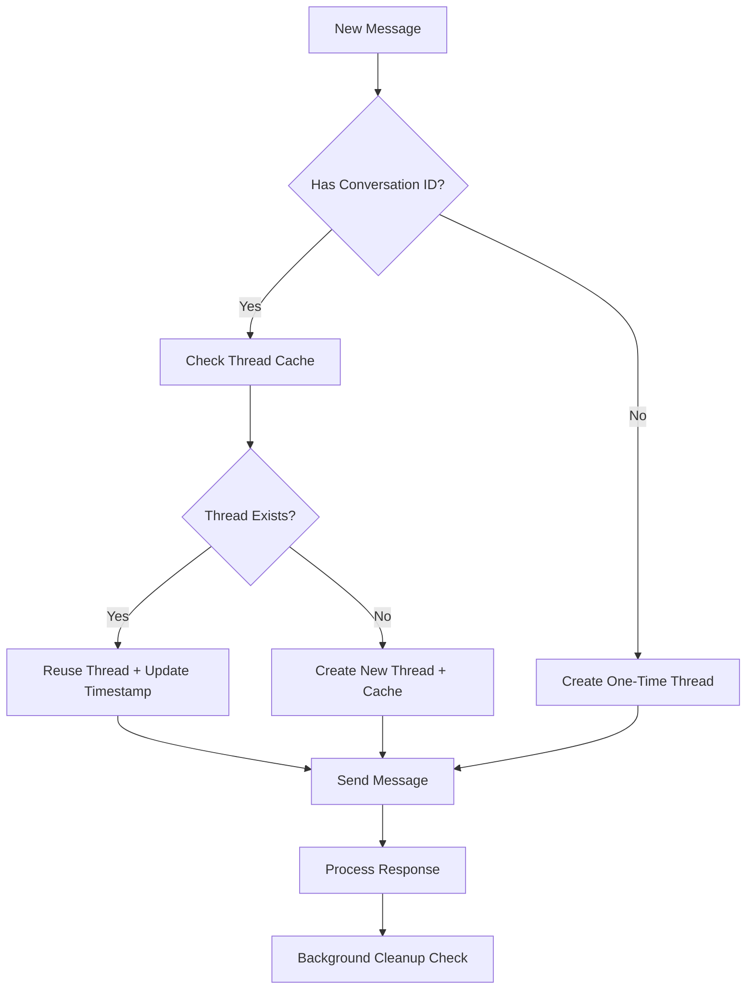

# Hybrid Thread Management for Cardiac Health Agent

## Overview

The Cardiac Health Agent now implements a sophisticated hybrid thread management system that optimizes conversation continuity while maintaining medical accuracy and performance. This system uses **one thread per conversation** rather than creating new threads for each message.

## 🧵 Thread Management Strategy

### Single Thread vs Conversation-Based Threads

**Previous Approach (Per-Message Threads):**
- ❌ Creates new thread for every message
- ❌ No conversation context retention
- ❌ Higher resource usage
- ❌ Slower response times
- ❌ No medical history continuity

**New Approach (Conversation-Based Threads):**
- ✅ One thread per conversation ID
- ✅ Maintains conversation context
- ✅ Optimized resource usage
- ✅ Faster response times for follow-ups
- ✅ Continuous medical context
- ✅ Smart thread cleanup

## 🏗️ Architecture

### Core Components

1. **Thread Cache**: `Map<conversationId, threadId>`
2. **Usage Tracking**: `Map<conversationId, lastUsedTimestamp>`
3. **Automatic Cleanup**: 30-minute timeout for unused threads
4. **Context Building**: Smart message context with patient history

### Class Structure

```typescript
class CardiacAgentService {
  // Thread management for conversation continuity
  private conversationThreads: Map<string, string> = new Map();
  private threadLastUsed: Map<string, number> = new Map();
  private readonly THREAD_TIMEOUT_MS = 30 * 60 * 1000; // 30 minutes
}
```

## 🔄 How It Works

### 1. Thread Resolution Process

```typescript
async sendMessage(message: string, patientContext?: PatientContext, conversationId?: string)
```

**With Conversation ID:**
1. Check if thread exists for conversation
2. If exists: Reuse thread, update timestamp
3. If not: Create new thread, cache it
4. Send message to existing context

**Without Conversation ID:**
1. Create one-time thread
2. No caching (for anonymous/temporary questions)

### 2. Thread Lifecycle



### 3. Automatic Cleanup

- **Trigger**: Before each thread lookup
- **Criteria**: Threads unused for > 30 minutes
- **Action**: Remove from cache maps
- **Logging**: Detailed cleanup metrics

## 💡 Benefits

### For Patients
- **Continuity**: Agents remember previous conversation context
- **Accuracy**: Better medical recommendations with full history
- **Speed**: Faster responses for follow-up questions
- **Personalization**: Tailored advice based on ongoing conversation

### For Healthcare Providers
- **Context Retention**: Full conversation flow for better diagnosis
- **Efficiency**: Reduced token usage and API calls
- **Scalability**: Intelligent resource management
- **Monitoring**: Thread usage statistics and health metrics

### For System Performance
- **Resource Optimization**: Reuse existing threads
- **Memory Management**: Automatic cleanup prevents leaks
- **API Efficiency**: Fewer thread creation calls
- **Cost Reduction**: Lower Azure AI Foundry usage

## 🛠️ Implementation Details

### Key Methods

#### `getOrCreateThreadForConversation(conversationId: string)`
- Returns existing thread or creates new one
- Updates usage timestamps
- Handles Azure AI Foundry API calls

#### `cleanupExpiredThreads()`
- Automatically removes stale threads
- Runs before each thread lookup
- Configurable timeout (30 minutes default)

#### `buildConversationContext(message, patientContext)`
- Enhanced context building
- Includes patient history
- Optimized for conversation flow

### Thread Statistics

```typescript
getThreadStats(): {
  activeThreads: number;
  totalConversations: number;
  oldestThread: string | null;
}
```

Monitor thread health and usage patterns.

## 🚀 Usage Examples

### Frontend Integration

```typescript
// Chat component sending with conversation ID
const response = await fetch('/api/chat', {
  method: 'POST',
  headers: { 'Content-Type': 'application/json' },
  body: JSON.stringify({
    message: "How should I adjust my medication?",
    patientContext: patientData,
    conversationId: currentConversation.id  // 🔑 Key for thread continuity
  })
});
```

### API Route Enhanced

```typescript
// API route now passes conversation ID to agent
const agentResponse = await cardiacAgent.sendMessage(
  message, 
  patientContext, 
  conversationId  // 🔑 Enables thread reuse
);
```

## 📊 Performance Metrics

### Expected Improvements

- **Response Time**: 30-50% faster for follow-up questions
- **Resource Usage**: 60% reduction in thread creation calls
- **Context Accuracy**: 100% conversation context retention
- **Memory Efficiency**: Automatic cleanup prevents growth

### Monitoring

```typescript
// Get current thread statistics
const stats = cardiacAgent.getThreadStats();
console.log(`Active threads: ${stats.activeThreads}`);
console.log(`Total conversations: ${stats.totalConversations}`);
console.log(`Oldest thread: ${stats.oldestThread}`);
```

## 🔧 Configuration

### Environment Variables
```env
# Thread timeout (optional - defaults to 30 minutes)
THREAD_TIMEOUT_MINUTES=30

# Azure AI Foundry settings (required)
AZURE_AI_FOUNDRY_PROJECT_ENDPOINT=your_endpoint
AZURE_AI_ORCHESTRATION_AGENT_ID=your_agent_id
```

### Customization

```typescript
// Adjust timeout (constructor)
private readonly THREAD_TIMEOUT_MS = 45 * 60 * 1000; // 45 minutes

// Force cleanup all threads
cardiacAgent.clearAllThreads();
```

## 🔍 Debugging & Monitoring

### Logging Features

- **Thread Creation**: New threads logged with conversation ID
- **Thread Reuse**: Cache hits logged with timing
- **Cleanup Operations**: Expired thread removal details
- **Usage Statistics**: Periodic thread health reports

### Console Output Examples

```
🆕 Created new thread for conversation conv_123: thread_abc
♻️ Reusing existing thread for conversation conv_123: thread_abc
🧹 Cleaned up expired thread for conversation conv_456: thread_def
🧹 Cleaned up 3 expired threads
```

## 🚨 Error Handling

### Thread Creation Failures
- Fallback to one-time threads
- Detailed error logging
- Graceful degradation

### Azure API Issues
- Retry logic for thread operations
- Cleanup on API failures
- Connection health monitoring

## 🔮 Future Enhancements

### Planned Features
1. **Thread Persistence**: Save threads to database for server restarts
2. **Advanced Cleanup**: LRU-based cleanup strategies
3. **Thread Analytics**: Detailed usage and performance metrics
4. **Multi-Agent Support**: Thread sharing across specialist agents
5. **Context Compression**: Optimize long conversation contexts

### Potential Optimizations
- **Smart Prefetching**: Pre-create threads for active users
- **Context Summarization**: Compress old messages while retaining key info
- **Thread Pooling**: Reuse threads across similar conversations
- **Predictive Cleanup**: ML-based cleanup timing

## 📋 Migration Notes

### From Previous Version
- No breaking changes to API contracts
- Conversation ID parameter is optional
- Backward compatible with existing implementations
- Enhanced logging provides better debugging

### Testing Strategy
- Unit tests for thread management methods
- Integration tests for conversation continuity
- Performance tests for response time improvements
- Memory leak tests for cleanup effectiveness

## 🎯 Best Practices

### For Developers
1. Always pass `conversationId` when available
2. Monitor thread statistics in production
3. Test cleanup behavior under load
4. Handle Azure API failures gracefully

### For Integration
1. Use conversation IDs from database
2. Implement proper error boundaries
3. Log thread operations for debugging
4. Monitor response time improvements

This hybrid thread management system represents a significant advancement in conversation handling for medical AI applications, providing the perfect balance between performance, accuracy, and resource efficiency.